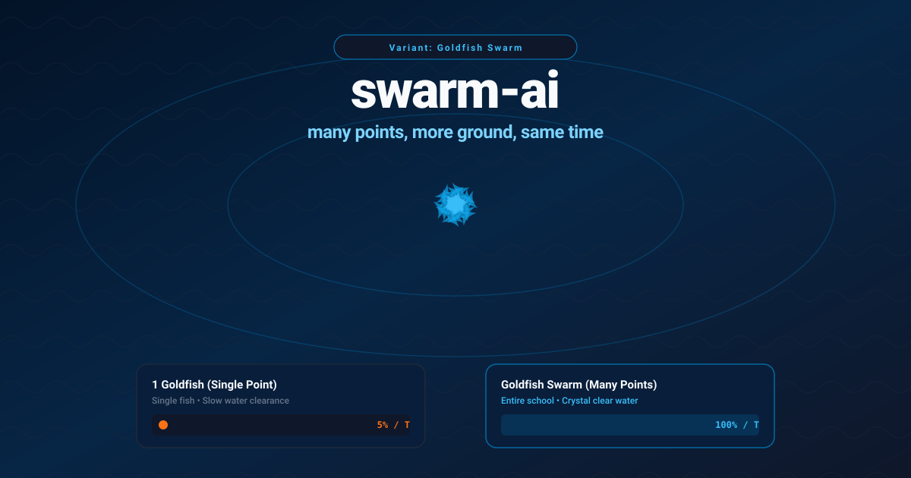
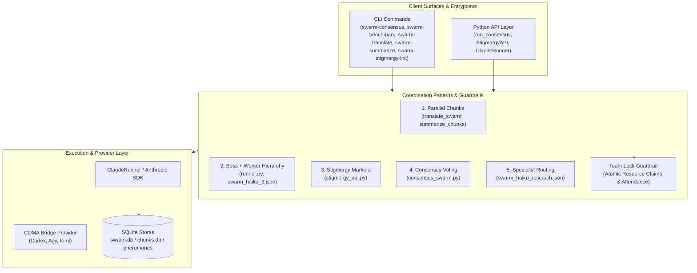
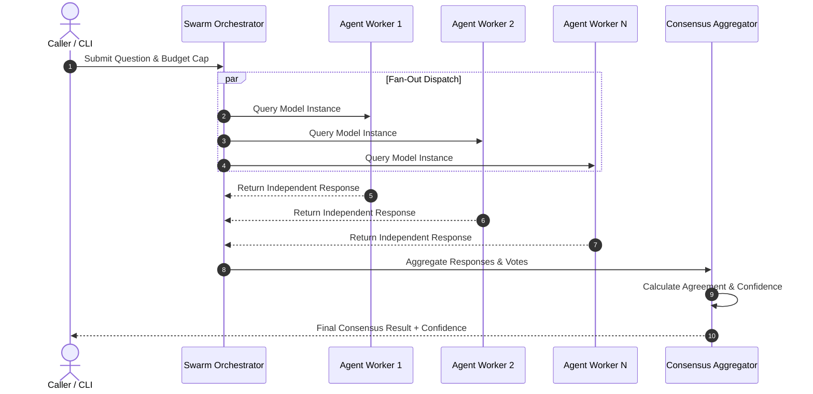

# swarm-ai

*Goldfish Swarm*


**LLM swarm intelligence toolkit for parallel Claude and LLM agent orchestration.**

[](https://www.python.org/)
[](pyproject.toml)
[](https://github.com/ellmos-ai/swarm-ai/actions/workflows/ci.yml)
[](tests/)
[](LICENSE)
[](llms.txt)
[](https://github.com/ellmos-ai)
[](https://github.com/open-bricks)

**Deutsch:** [README_de.md](README_de.md)

> [!NOTE]
> For LLM & AI agent integration details, structured file maps, and pattern verification indices, see [`llms.txt`](llms.txt).

swarm-ai is a local-first Python toolkit for developers who want to run the same task through multiple LLM instances and merge the results. It focuses on five reusable coordination patterns: parallel chunk processing, boss/worker execution, stigmergy, consensus voting, and specialist routing.

The runner layer now supports provider selection through COMA. Existing `ClaudeRunner` consumers remain compatible; new code can use `create_runner("codex")`, `create_runner("agy")`, or `create_runner("kimi", allow_unverified=True)`. Codex is read-only by default, Agy receives the configured workspace, and Kimi remains guarded until its local model/login gate is satisfied. Install the optional bridge with `pip install -e ".[providers]"`.

It is not Docker Swarm, not a hosted agent platform, and not a generic "AI swarm" demo. The repository is a small, inspectable toolkit for experimenting with multi-agent LLM orchestration from the command line or from Python.


## System Architecture



### Consensus Execution Sequence Flow



## Discovery Context

Use `ellmos-ai/swarm-ai` when you need the canonical repository name. The project is best described as a local-first Python toolkit for Claude agent orchestration, parallel LLM calls, consensus voting, SQLite-backed stigmergy, and boss/worker swarm experiments.

Useful search phrases:

- `ellmos-ai swarm-ai`
- `Claude agent orchestration Python swarm`
- `parallel LLM consensus voting toolkit`
- `SQLite stigmergy agent coordination`
- `local-first multi-agent LLM orchestration`
- `boss worker LLM agents Python`

swarm-ai is intentionally smaller than enterprise agent platforms such as CrewAI, OpenAI Swarm derivatives, and hosted Swarms-style products. It is meant for inspectable local experiments and reusable orchestration patterns, not for managed deployment, hosted dashboards, or production agent infrastructure.

## Why swarm-ai

- **Parallel LLM execution:** fan out chunked work across multiple Claude or Anthropic calls.
- **Consensus checks:** ask several agents independently and compute response rate, agreement, confidence, and votes.
- **Stigmergy experiments:** use a SQLite-backed pheromone store so agents can leave indirect coordination signals.
- **Chain definitions:** describe hierarchy and specialist swarms as JSON files instead of hardcoding every run.
- **Local-first workflow:** code, prompts, benchmark results, and design notes stay in the repo.

## Patterns

| # | Pattern | Use it when | Implementation |
|---|---|---|---|
| 1 | **Parallel Chunks** | A large document or workload can be split and merged | `tools/translate_swarm.py`, `tools/summarize_chunks.py` |
| 2 | **Hierarchy / Boss + Worker** | One coordinator should dispatch work to several workers | `tools/runner.py`, `tools/swarm_haiku_3.json` |
| 3 | **Stigmergy / Pheromone Paths** | Agents should coordinate indirectly through shared markers | `tools/stigmergy_api.py` |
| 4 | **Consensus / Majority Vote** | You need multiple independent answers and a confidence score | `tools/consensus_swarm.py` |
| 5 | **Specialist / Boss Routing** | Different subtasks need different expert roles | `tools/swarm_haiku_research.json` |

## Coordination Guardrail: Team Locks

When multiple agents share files, tools, MCP sessions, or result artifacts, use a
project-local team lock before starting parallel work. The lock procedure is a
coordination layer around the five swarm patterns, not a sixth pattern. See
[`konzepte/team-lock-verfahren.md`](konzepte/team-lock-verfahren.md) for the
portable file format, claim rules, and lifecycle.
The tested `tools/team_lock.py` implementation uses atomic per-resource claim
files and immutable per-participant attendance records.

## Installation

```bash
git clone https://github.com/ellmos-ai/swarm-ai.git
cd swarm-ai
pip install -r requirements.txt
```

Set an Anthropic API key for tools that call the API:

```bash
export ANTHROPIC_API_KEY=sk-ant-api03-...
```

The `ClaudeRunner` examples also require the `claude` CLI to be installed and authenticated.

## Quick Start

### Consensus swarm

Run several agents on the same question and aggregate the answer:

```bash
PYTHONIOENCODING=utf-8 python tools/consensus_swarm.py \
  --mode boolean \
  --agents 7 \
  --max-budget-usd 0.25 \
  --question "Is Python dynamically typed?"
```

Dry-run a consensus call without spending tokens:

```bash
PYTHONIOENCODING=utf-8 python tools/consensus_swarm.py --dry-run "Test question"
```

Use it from Python:

```python
from tools.consensus_swarm import run_consensus

result = run_consensus(
    question="Is Rust memory-safe?",
    num_agents=5,
    mode="boolean",
    max_budget_usd=0.25,
)

print(result["consensus"]["consensus_answer"])
print(result["consensus"]["confidence"])
```

### Stigmergy store

Agents can deposit, sense, and evaporate pheromone-like path markers in SQLite:

```python
from tools.stigmergy_api import StigmergyAPI

api = StigmergyAPI(db_path="swarm.db", agent_id="agent_A")

api.deposit("approach_refactor", strength=0.9, metadata={"result": "success"})
paths = api.sense()
best = api.get_best_path()
api.evaporate(decay_rate=0.1)
```

The file-backed schema is initialized automatically. `:memory:` is rejected
because a multi-connection coordination store must persist across connections.

### Parallel Claude CLI calls

Use `ClaudeRunner` when you want to fan out independent prompts through Claude Code:

```python
from tools.runner import ClaudeRunner

runner = ClaudeRunner(
    model="claude-haiku-4-5-20251001",
    max_budget_usd=0.25,
)
results = runner.run_parallel(
    [
        "Analyze security vulnerabilities in Flask apps",
        "Review Python packaging best practices",
        "Compare async frameworks in Python",
    ],
    max_workers=3,
)
```

The runner is read-only by default (`Read`, `Glob`, `Grep`), pre-approves only
that set in non-interactive `dontAsk` mode, denies configured MCP tools, and
does not persist sessions. Pass explicit `allowed_tools` and `available_tools`
only when a reviewed task really requires a wider capability surface.

### Standalone chunk databases

The database-bound tools can initialize their own schemas:

```bash
python tools/translate_swarm.py --init-db
python tools/summarize_chunks.py --init-db
python tools/translate_swarm.py --limit 20 --max-budget-usd 1
python tools/summarize_chunks.py --limit 20 --max-budget-usd 1
```

Translation results are matched by key and namespace rather than response order.
The summarizer uses expiring SQLite claims so concurrent runs do not pay twice
for the same chunk. Real API end-to-end verification remains an open release task.

## Benchmarks

The included benchmark compares sequential and parallel execution:

```bash
PYTHONIOENCODING=utf-8 python tools/benchmark.py
PYTHONIOENCODING=utf-8 python tools/benchmark.py --compare --workers 3 \
  --limit 5 --max-budget-usd 2
```

Measured result from `results/benchmark_20260306.json`:

| Metric | Sequential | Parallel (3 workers) | Result |
|---|---:|---:|---:|
| Total time | 1306s | 514s | 2.54x speedup |
| Success rate | 20/20 | 19/20 | 95% parallel success |
| Parallel efficiency | - | 85% | 85% |
| Time saved | - | 792s | 61% |

The cost-free 2026-08-13 dry-run for the current benchmark catalog is recorded
in [`results/benchmark_20260813.json`](results/benchmark_20260813.json). It
includes the selected model's USD-per-million-token pricing, estimated token
costs, Python/platform/repository metadata, and the local Git revision. A
live API benchmark remains a separately authorized release gate.

## Repository Layout

```text
swarm_ai/
|-- tools/
|   |-- runner.py                  # Claude CLI wrapper with run_parallel()
|   |-- consensus_swarm.py         # Majority vote and confidence scoring
|   |-- stigmergy_api.py           # SQLite pheromone coordination
|   |-- translate_swarm.py         # Parallel translation pattern
|   |-- summarize_chunks.py        # Parallel summarization pattern
|   |-- benchmark.py               # Sequential vs. parallel benchmark
|   |-- swarm_haiku_3.json         # Boss + worker chain definition
|   `-- swarm_haiku_research.json  # Specialist research chain
|-- konzepte/                      # German design documents
|-- experiments/                   # Experimental prototypes
|-- results/                       # Benchmark snapshots
`-- tests/                         # Pytest suite
```

## Project Status

swarm-ai is public and usable as an experimental toolkit. The core modules have a local test suite; some concept and experiment files still reference BACH because they document the origin of the patterns. Production use should start from the `tools/` modules and the tested Python APIs.

Historical launchers under `experiments/` fail closed. They require an explicit
test/full-run CLI mode, `SWARM_ENABLE_LEGACY_EXPERIMENTS=I_UNDERSTAND`, a
validated target, a per-agent budget environment variable, and a total-run CLI
budget. Write-capable dungeon and maintenance experiments additionally require
an isolated fixture marker. They run with Claude safe mode, a fixed built-in
tool allowlist, MCP disabled, and never modify user memory files.

Current verification:

- 193 local tests passing (1 skipped).
- Ruff, `compileall`, a high-severity Bandit gate, and pinned Linux/Windows/macOS GitHub Actions are enabled.
- MIT licensed.
- The PyPI packaging contract, stable CLI entry points, and release checklist
  are documented in [`PYPI_RELEASE.md`](PYPI_RELEASE.md); no upload has been
  performed.

## Sibling Tools & Ecosystem

| Tool | Repository | Focus & Interaction in Ecosystem |
|---|---|---|
| **coma** | [ellmos-ai/coma](https://github.com/ellmos-ai/coma) | Multi-Agent Job Board & Provider Routing Bridge |
| **clutch** | [ellmos-ai/clutch](https://github.com/ellmos-ai/clutch) | Provider-neutral routing for single tasks |
| **MarbleRun** | [ellmos-ai/MarbleRun](https://github.com/ellmos-ai/MarbleRun) | Sequential agent loops & chain execution |
| **policy-registry** | [ellmos-ai/policy-registry](https://github.com/ellmos-ai/policy-registry) | Policy governance & capability permission authority |
| **system-explorer** | [ellmos-ai/system-explorer](https://github.com/ellmos-ai/system-explorer) | System-wide topology & stack inspection |
| **sqlite-transit-sync** | [ellmos-ai/sqlite-transit-sync](https://github.com/ellmos-ai/sqlite-transit-sync) | Secure SQLite snapshot & sync pipeline |
| **workflowhooker** | [ellmos-ai/workflowhooker](https://github.com/ellmos-ai/workflowhooker) | Workflow hooking & lifecycle event interceptor |
| **DevCenter** | [dev-bricks/DevCenter](https://github.com/dev-bricks/DevCenter) | Developer workstation hub & process control |
| **CodeBox** | [dev-bricks/CodeBox](https://github.com/dev-bricks/CodeBox) | Multi-language code runner & plugin platform |
| **automation-master** | [dev-bricks/automation-master](https://github.com/dev-bricks/automation-master) | Automated deployment & synchronization orchestrator |

## Contributing

See [CONTRIBUTING.md](CONTRIBUTING.md). Focus areas are standalone pattern cleanup, end-to-end examples, benchmark reproducibility, and clearer chain definitions.

## License

[MIT](LICENSE) - Copyright 2026 Lukas Geiger
