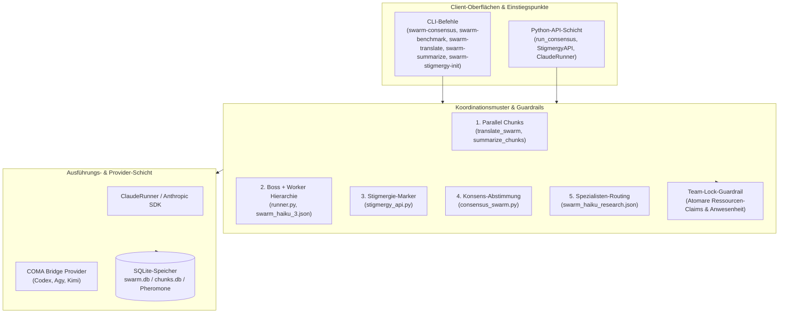
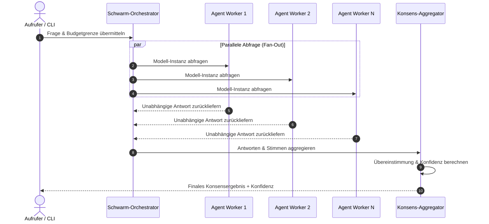

# swarm-ai

**LLM-Schwarmintelligenz-Toolkit für parallele Claude- und LLM-Agenten-Orchestrierung.**

[](https://www.python.org/)
[](pyproject.toml)
[](https://github.com/ellmos-ai/swarm-ai/actions/workflows/ci.yml)
[](tests/)
[](LICENSE)
[](llms.txt)
[](https://github.com/ellmos-ai)
[](https://github.com/open-bricks)

**English:** [README.md](README.md)

> [!NOTE]
> Für LLM- & KI-Agenten-Integrationsdetails, strukturierte Dateikarten und Muster-Verifizierungs-Indizes siehe [`llms.txt`](llms.txt).

swarm-ai ist ein local-first Python-Toolkit für Entwicklerinnen und Entwickler, die dieselbe Aufgabe über mehrere LLM-Instanzen ausführen und die Ergebnisse anschließend zusammenführen wollen. Der Fokus liegt auf fünf wiederverwendbaren Koordinationsmustern: parallele Chunk-Verarbeitung, Boss-/Worker-Ausführung, Stigmergie, Konsensabstimmung und Spezialisten-Routing.

Die Runner-Schicht unterstützt jetzt die Provider-Auswahl über COMA. Bestehende `ClaudeRunner`-Verwendungen bleiben kompatibel; neuer Code kann `create_runner("codex")`, `create_runner("agy")` oder `create_runner("kimi", allow_unverified=True)` nutzen. Codex ist standardmäßig schreibgeschützt, Agy erhält den konfigurierten Workspace, und Kimi bleibt bis zur lokalen Modell-/Login-Freigabe gesperrt. Installiere die optionale Bridge mit `pip install -e ".[providers]"`.

Das Projekt ist kein Docker-Swarm-Werkzeug, keine gehostete Agentenplattform und keine generische "AI swarm"-Demo. Es ist ein kleines, prüfbares Toolkit für Experimente mit Multi-Agent-LLM-Orchestrierung über CLI und Python.


## Systemarchitektur



### Konsens-Ausführungssequenz



## Auffindbarkeitskontext

Nutze `ellmos-ai/swarm-ai`, wenn der kanonische Repository-Name gemeint ist. Das Projekt lässt sich am besten als local-first Python-Toolkit für Claude-Agenten-Orchestrierung, parallele LLM-Aufrufe, Konsensabstimmung, SQLite-gestützte Stigmergie und Boss-/Worker-Schwarmexperimente beschreiben.

Nützliche Suchphrasen:

- `ellmos-ai swarm-ai`
- `Claude agent orchestration Python swarm`
- `parallel LLM consensus voting toolkit`
- `SQLite stigmergy agent coordination`
- `local-first multi-agent LLM orchestration`
- `boss worker LLM agents Python`

swarm-ai ist bewusst kleiner als Enterprise-Agentenplattformen wie CrewAI, OpenAI-Swarm-Ableitungen oder gehostete Swarms-Produkte. Es ist für prüfbare lokale Experimente und wiederverwendbare Orchestrierungsmuster gedacht, nicht für Managed Deployment, gehostete Dashboards oder produktive Agenteninfrastruktur.

## Warum swarm-ai

- **Parallele LLM-Ausführung:** große Aufgaben in Teilstücke aufteilen und über mehrere Claude- oder Anthropic-Aufrufe verarbeiten.
- **Konsensprüfungen:** mehrere Agenten unabhängig antworten lassen und Antwortrate, Zustimmung, Konfidenz und Stimmen berechnen.
- **Stigmergie-Experimente:** ein SQLite-basierter Pheromonspeicher ermöglicht indirekte Koordinationssignale zwischen Agenten.
- **Chain-Definitionen:** Hierarchie- und Spezialisten-Schwärme werden als JSON beschrieben statt fest verdrahtet.
- **Local-first Workflow:** Code, Prompts, Benchmarks und Designdokumente bleiben lokal und versioniert im Repo.

## Muster

| # | Muster | Geeignet für | Implementierung |
|---|---|---|---|
| 1 | **Parallel-Chunks** | Große Dokumente oder Aufgaben, die teilbar und zusammenführbar sind | `tools/translate_swarm.py`, `tools/summarize_chunks.py` |
| 2 | **Hierarchie / Boss + Worker** | Ein Koordinator verteilt Arbeit an mehrere Worker | `tools/runner.py`, `tools/swarm_haiku_3.json` |
| 3 | **Stigmergie / Pheromonpfade** | Agenten koordinieren sich indirekt über gemeinsame Marker | `tools/stigmergy_api.py` |
| 4 | **Konsens / Mehrheitsentscheid** | Mehrere unabhängige Antworten sollen zu Konfidenz und Abstimmung führen | `tools/consensus_swarm.py` |
| 5 | **Spezialist / Boss-Routing** | Unterschiedliche Teilaufgaben brauchen unterschiedliche Expertenrollen | `tools/swarm_haiku_research.json` |

## Koordinations-Guardrail: Team-Locks

Wenn mehrere Agenten Dateien, Tools, MCP-Sitzungen oder Ergebnisartefakte teilen,
sollte vor der parallelen Arbeit ein projektlokaler Team-Lock gesetzt werden. Das
Lock-Verfahren ist eine Koordinationsschicht um die fünf Schwarmmuster, kein
sechstes Muster. Das portable Dateiformat, Claim-Regeln und der Lebenszyklus sind
in [`konzepte/team-lock-verfahren.md`](konzepte/team-lock-verfahren.md) beschrieben.
Die getestete Implementierung `tools/team_lock.py` nutzt atomare Claims pro
Ressource und unveränderliche Anwesenheitsdateien pro Teilnehmer.

## Installation

```bash
git clone https://github.com/ellmos-ai/swarm-ai.git
cd swarm-ai
pip install -r requirements.txt
```

Für Tools mit API-Aufrufen wird ein Anthropic API-Key benötigt:

```bash
export ANTHROPIC_API_KEY=sk-ant-api03-...
```

Die `ClaudeRunner`-Beispiele benötigen zusätzlich eine installierte und authentifizierte `claude`-CLI.

## Schnellstart

### Konsens-Schwarm

Mehrere Agenten beantworten dieselbe Frage, anschließend wird aggregiert:

```bash
PYTHONIOENCODING=utf-8 python tools/consensus_swarm.py \
  --mode boolean \
  --agents 7 \
  --max-budget-usd 0.25 \
  --question "Is Python dynamically typed?"
```

Trockenlauf ohne Tokenkosten:

```bash
PYTHONIOENCODING=utf-8 python tools/consensus_swarm.py --dry-run "Test question"
```

Verwendung aus Python:

```python
from tools.consensus_swarm import run_consensus

result = run_consensus(
    question="Is Rust memory-safe?",
    num_agents=5,
    mode="boolean",
    max_budget_usd=0.25,
)

print(result["consensus"]["consensus_answer"])
print(result["consensus"]["confidence"])
```

### Stigmergie-Speicher

Agenten können Pheromon-Marker in SQLite ablegen, abtasten und verdampfen lassen:

```python
from tools.stigmergy_api import StigmergyAPI

api = StigmergyAPI(db_path="swarm.db", agent_id="agent_A")

api.deposit("approach_refactor", strength=0.9, metadata={"result": "success"})
paths = api.sense()
best = api.get_best_path()
api.evaporate(decay_rate=0.1)
```

Das dateibasierte Schema wird automatisch initialisiert. `:memory:` wird
abgelehnt, da ein Multi-Connection-Koordinationsspeicher über Verbindungen
hinweg persistieren muss.

### Parallele Claude CLI-Aufrufe

Nutze `ClaudeRunner`, um unabhängige Prompts parallel über Claude Code auszuführen:

```python
from tools.runner import ClaudeRunner

runner = ClaudeRunner(
    model="claude-haiku-4-5-20251001",
    max_budget_usd=0.25,
)
results = runner.run_parallel(
    [
        "Analyze security vulnerabilities in Flask apps",
        "Review Python packaging best practices",
        "Compare async frameworks in Python",
    ],
    max_workers=3,
)
```

Der Runner ist standardmäßig schreibgeschützt (`Read`, `Glob`, `Grep`),
genehmigt im nicht-interaktiven `dontAsk`-Modus nur diese Werkzeuge vorab,
lehnt konfigurierte MCP-Werkzeuge ab und persistiert keine Sitzungen.

### Eigenständige Chunk-Datenbanken

Die datenbankgebundenen Werkzeuge können ihre Schemas eigenständig initialisieren:

```bash
python tools/translate_swarm.py --init-db
python tools/summarize_chunks.py --init-db
python tools/translate_swarm.py --limit 20 --max-budget-usd 1
python tools/summarize_chunks.py --limit 20 --max-budget-usd 1
```

Übersetzungsergebnisse werden nach Schlüssel und Namespace statt nach
Antwortreihenfolge zugeordnet. Der Summarizer nutzt ablaufende SQLite-Claims,
sodass parallele Läufe nicht doppelt für denselben Chunk zahlen.

## Benchmarks

Der enthaltene Benchmark vergleicht sequenzielle und parallele Ausführung:

```bash
PYTHONIOENCODING=utf-8 python tools/benchmark.py
PYTHONIOENCODING=utf-8 python tools/benchmark.py --compare --workers 3 \
  --limit 5 --max-budget-usd 2
```

Messergebnis aus `results/benchmark_20260306.json`:

| Metrik | Sequenziell | Parallel (3 Worker) | Ergebnis |
|---|---:|---:|---:|
| Gesamtzeit | 1306s | 514s | 2,54x Beschleunigung |
| Erfolgsquote | 20/20 | 19/20 | 95% paralleler Erfolg |
| Parallele Effizienz | - | 85% | 85% |
| Gesparte Zeit | - | 792s | 61% |

Der tokenfreie Trockenlauf für den aktuellen Benchmark-Katalog vom 2026-08-13 ist
in [`results/benchmark_20260813.json`](results/benchmark_20260813.json) erfasst.

## Repository-Struktur

```text
swarm_ai/
|-- tools/
|   |-- runner.py                  # Claude CLI-Wrapper mit run_parallel()
|   |-- consensus_swarm.py         # Mehrheitsentscheid und Konfidenzbewertung
|   |-- stigmergy_api.py           # SQLite-Pheromonkoordination
|   |-- translate_swarm.py         # Paralleles Übersetzungsmuster
|   |-- summarize_chunks.py        # Paralleles Zusammenfassungsmuster
|   |-- benchmark.py               # Sequenzieller vs. paralleler Benchmark
|   |-- swarm_haiku_3.json         # Boss + Worker Chain-Definition
|   `-- swarm_haiku_research.json  # Spezialisten-Research-Chain
|-- konzepte/                      # Deutsche Designdokumente
|-- experiments/                   # Experimentelle Prototypen
|-- results/                       # Benchmark-Snapshots
`-- tests/                         # Pytest-Testsuite
```

## Projektstatus

swarm-ai ist öffentlich und als experimentelles Toolkit nutzbar. Die Kernmodule verfügen über eine lokale Testsuite. Für den produktiven Einsatz sollte von den `tools/`-Modulen und den getesteten Python-APIs ausgegangen werden.

Aktuelle Verifikation:

- 193 lokale Tests erfolgreich (1 übersprungen).
- Ruff, `compileall`, ein High-Severity-Bandit-Gate und GitHub Actions für Linux/Windows/macOS sind aktiv.
- MIT-lizenziert.
- Der PyPI-Packaging-Vertrag, stabile CLI-Einstiegspunkte und die Release-Checkliste sind in [`PYPI_RELEASE.md`](PYPI_RELEASE.md) dokumentiert.

## Geschwisterwerkzeuge & Ökosystem

| Werkzeug | Repository | Fokus & Interaktion im Ökosystem |
|---|---|---|
| **coma** | [ellmos-ai/coma](https://github.com/ellmos-ai/coma) | Multi-Agent Job Board & Provider Routing Bridge |
| **clutch** | [ellmos-ai/clutch](https://github.com/ellmos-ai/clutch) | Provider-neutrales Routing für Einzelaufgaben |
| **MarbleRun** | [ellmos-ai/MarbleRun](https://github.com/ellmos-ai/MarbleRun) | Sequenzielle Agentenketten und Schleifenausführung |
| **policy-registry** | [ellmos-ai/policy-registry](https://github.com/ellmos-ai/policy-registry) | Governance, Berechtigungs- und Richtlinienverwaltung |
| **system-explorer** | [ellmos-ai/system-explorer](https://github.com/ellmos-ai/system-explorer) | Systemweite Topologie- und Stack-Inspektion |
| **sqlite-transit-sync** | [ellmos-ai/sqlite-transit-sync](https://github.com/ellmos-ai/sqlite-transit-sync) | Sichere SQLite Snapshot- und Sync-Pipeline |
| **workflowhooker** | [ellmos-ai/workflowhooker](https://github.com/ellmos-ai/workflowhooker) | Workflow-Hooking und Lifecycle-Events |
| **DevCenter** | [dev-bricks/DevCenter](https://github.com/dev-bricks/DevCenter) | Entwickler-Dashboard & Workspace-Management |
| **CodeBox** | [dev-bricks/CodeBox](https://github.com/dev-bricks/CodeBox) | Multi-Language Code Runner & Plugin Platform |
| **automation-master** | [dev-bricks/automation-master](https://github.com/dev-bricks/automation-master) | Automatisierte Deployment- & Sync-Orchestrierung |

## Mitwirken

Siehe [CONTRIBUTING.md](CONTRIBUTING.md). Schwerpunkte sind eigenständige Muster-Bereinigung, End-to-End-Beispiele, Benchmark-Reproduzierbarkeit und präzisere Chain-Definitionen.

## Lizenz

[MIT](LICENSE) - Copyright 2026 Lukas Geiger
