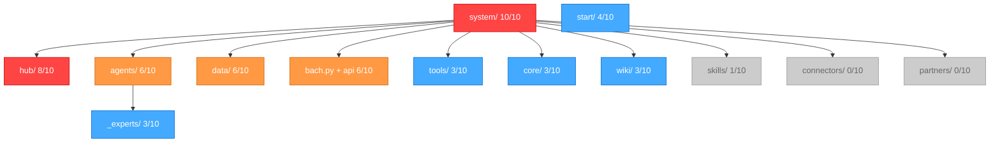

# LLM-Navigationsexperiment: Heatmap-Analyse

**Datum:** 2026-02-15
**Proben:** 10 (5 Haiku + 5 Sonnet)
**Aufgaben:** Task erstellen, BACH starten, Steuerbelege, Tasks listen, Tools finden, Wiki schreiben, Logs lesen, Agenten listen, DB exportieren, System-Status

---

## Navigations-Heatmap (BACH system/)

```
HITZE-SKALA: ████ HOT (8-10)  ░░░░ WARM (4-7)  ···· COOL (1-3)  ---- COLD (0)

BACH/system/                          ████████████████████ 10/10
│
├── hub/                                         ████████████████     8/10  🔥
│   ├── bach_paths.py                            ░░░░░░░░             4/10
│   ├── steuer.py                                ░░░░░░░░             4/10
│   ├── task.py                                  ····                 3/10
│   └── __init__.py                              ·                    1/10
│
├── bach.py                    (Root-Datei)       ······               3/10
├── bach_api.py                (Root-Datei)       ······               3/10
│
├── agents/                                      ░░░░░░░░░░░░        6/10  🔥
│   ├── README.md                                ·                    1/10
│   ├── ati/SKILL.md                             ·                    1/10
│   ├── entwickler/SKILL.md                      ·                    1/10
│   ├── production/SKILL.md                      ·                    1/10
│   ├── reflection/SKILL.md                      ·                    1/10
│   └── _experts/                                ····                 3/10
│       └── steuer/steuer-beleg-scan.md           ·                    1/10
│
├── data/                                        ░░░░░░░░░░░░        6/10  🔥
│   ├── bach.db                                  ··                   2/10
│   ├── schema_bach.sql                          ·                    1/10
│   ├── quick_tasks_queue.json                   ·                    1/10
│   ├── dump_schema.py                           ·                    1/10
│   ├── logs/                                    · ⚠️ LEER            1/10
│   └── ati/                                     ·                    1/10
│
├── start/                     (../start/)       ░░░░░░░░             4/10
│   ├── README.md                                ·                    1/10
│   ├── BACH_Launcher.bat                        ·                    1/10
│   ├── start_console.bat                        ·                    1/10
│   └── start_gui.bat                            ·                    1/10
│
├── tools/                                       ······               3/10
│   ├── 60+ .py-Dateien                          ··                   2/10
│   └── generators/exporter.py                   ·                    1/10
│
├── core/                                        ······               3/10
│   └── db.py                                    ·                    1/10
│
├── wiki/                                        ······               3/10
│   ├── wiki_konventionen.txt                    ·                    1/10
│   ├── informatik/devops/                       ·                    1/10
│   └── n8n.txt                                  ·                    1/10
│
├── skills/                                      ·                    1/10
│   ├── _protocols/                              ·                    1/10
│   └── _services/                               ·                    1/10
│
├── connectors/                                  ----                 0/10  ❄️
│
└── partners/                                    ----                 0/10  ❄️
```

---

## Einstiegspunkte (Wie fanden die LLMs BACH?)

```
EINSTIEGSSTRATEGIE                    MODELL     ANZAHL
──────────────────────────────────────────────────────
Bash: find *BACH* / ls OneDrive      Haiku      4/5
Glob: **/BACH*/**                    Sonnet     4/5
Read: MEMORY.md (Pfad bekannt)       Haiku      1/5
Bash: ls system/ (direkt)            Sonnet     1/5

MUSTER: Haiku → Bash (find/ls)
        Sonnet → Glob (**/pattern/**)
        Nur 1 Agent nutzte MEMORY.md als Shortcut
```

---

## Tool-Nutzung aller 10 Proben

```
TOOL        AUFRUFE   ANTEIL    BALKEN
─────────────────────────────────────────
Bash          101      49%      ████████████████████████
Glob           47      23%      ███████████
Read           44      21%      ██████████
Grep           13       6%      ███
Write           0       0%
Edit            0       0%

GESAMT:       205
```

---

## Modell-Vergleich

```
                    HAIKU (5)         SONNET (5)
                    ─────────         ──────────
Pfade besucht       Ø 17.6            Ø 18.8
Tool-Aufrufe        Ø 19.0            Ø 22.0
Fehler              Ø 2.2             Ø 5.0
Unique Pfade        59                66
Stil                direkt            explorativ

Overlap: 5 gemeinsame Pfade
Haiku-exklusiv: 54 Pfade
Sonnet-exklusiv: 61 Pfade
```

---

## Meistbesuchte Dateien (Top 10)

```
RANG  BESUCHE  DATEI                           KONTEXT
────  ───────  ──────────────────────────────  ─────────────────
 1      4      hub/bach_paths.py               Pfad-Registry
 2      4      hub/steuer.py                   Steuer-Handler
 3      3      bach.py                         CLI-Hauptdatei
 4      3      bach_api.py                     API-Einstieg
 5      3      hub/task.py                     Task-Handler
 6      2      data/bach.db                    Datenbank
 7      2      tools/*.py                      Tool-Sammlung
 8      1      core/db.py                      DB-Verwaltung
 9      1      data/schema_bach.sql            DB-Schema
10      1      wiki/wiki_konventionen.txt      Wiki-Regeln
```

---

## Wo braucht es "Schilder" (Guardrails)?

### DRINGEND (viele Besucher, wenig Orientierung)
1. **hub/** (8/10) - Kein README.md vorhanden
   - Empfehlung: README mit Erklaerung was hub/ ist und welche Handler es gibt
2. **data/** (6/10) - Kein README.md vorhanden
   - Empfehlung: README mit Erklaerung der Datenbank-Struktur und Warnung vor Direktzugriff
3. **bach_api.py** (3/10) - Wird gelesen aber API-Nutzung nicht klar
   - Empfehlung: Docstring am Anfang mit "Quick Start" Beispielen

### WICHTIG (mittlere Besucherzahl, Verbesserungspotenzial)
4. **agents/** (6/10) - Hat README, funktioniert gut
5. **core/** (3/10) - Kein README, aber selten besucht
6. **tools/** (3/10) - Kein README mit Uebersicht
   - Empfehlung: README mit Tool-Kategorien und `bach tools list` Hinweis
7. **data/logs/** (1/10) - LEER, verwirrt Agenten
   - Empfehlung: README erklaert wo Logs wirklich sind (`bach logs tail`)

### BLIND SPOTS (nie besucht)
8. **connectors/** (0/10) - Kein Agent hat es gefunden
9. **partners/** (0/10) - Kein Agent hat es gefunden
10. **skills/_protocols/** (1/10) - Fast nie gefunden

---

## Mermaid-Diagramm (zum externen Rendern)



---

## Fazit und naechste Schritte

### Erkenntnisse
1. **hub/ ist der Magnet** - 8 von 10 Agenten landen dort, weil bach_paths.py wie ein Inhaltsverzeichnis wirkt
2. **Sonnet exploriert breiter**, Haiku ist **direkter und effizienter**
3. **connectors/ und partners/ sind unsichtbar** - brauchen bessere Verlinkung
4. **MEMORY.md als Shortcut** funktioniert hervorragend (Probe 7)
5. **Glob **/BACH** timeout** ist ein wiederkehrendes Problem fuer Sonnet

### Empfehlungen fuer den Gross-Versuch (100 Agenten)
1. README.md in hub/, data/, core/, tools/ anlegen
2. data/logs/ mit Erklaerung versehen
3. CLAUDE.md im system/-Verzeichnis mit Quick-Start-Anleitung
4. Dann erneut 100 Agenten loslassen und Verbesserung messen
